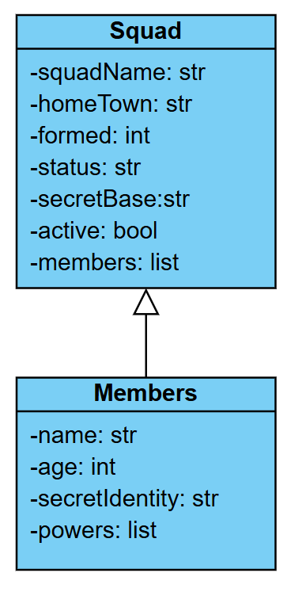

## Aufgabenbeschreibung

### 1. Erstellen eines UML-Klassendiagramms basierend auf den gegebenen Daten:
- **Fehlerbehebung** die JSON Datei ist nicht ganz korrekt, repariere sie.
- **Analysiere die Struktur des JSON-Dokuments** identifiziere die relevanten Klassen und ihre Attribute sowie Beziehungen zueinander.
- **Zeichne ein UML-Klassendiagramm**, das die Klassen, ihre Attribute und Methoden sowie die Beziehungen zwischen den Klassen (z.B. Assoziationen, Vererbungen) darstellt.




### 2. Implementierung der Klasse in Python:
- **Erstelle eine Python-Klasse oder Klassen**, die die Struktur des UML-Klassendiagramms widerspiegeln.
- **Definiere die Attribute und Methoden** entsprechend den Daten und Anforderungen aus dem JSON-Dokument.
[Second](Second)
Done

### 3. Einlesen der JSON-Daten als Objekte der erstellten Klasse(n):
- **Schreibe ein Python-Skript**, das die JSON-Daten einliest.
- **Erstelle Instanzen der zuvor definierten Klasse(n)** und initialisiere sie mit den Daten aus dem JSON-Dokument.
Done

### 4. Methode zum Hinzufügen eines Members:
- **Implementiere eine Methode in der entsprechenden Klasse**, die ein neues Mitglied zum Team hinzufügt.
- Die Methode sollte die benötigten Informationen (z.B. Name, ID) als Parameter entgegennehmen und ein neues Mitgliedsobjekt erstellen und zur entsprechenden Liste hinzufügen.
Done

### 5. Methode zur Ausgabe des Teams mit den jeweiligen Mitgliedern:
- **Implementiere eine Methode in der entsprechenden Klasse**, die das gesamte Team und deren Mitglieder auf eine lesbare Weise ausgibt.
- Die Methode sollte durch die Mitglieder des Teams iterieren und deren Details anzeigen.
Done

### 6. Methode zum Löschen eines Members anhand der ID:
- **Implementiere eine Methode in der entsprechenden Klasse**, die ein Mitglied anhand seiner ID löscht.
- Die Methode sollte die Liste der Mitglieder durchsuchen, das Mitglied mit der passenden ID finden und es aus der Liste entfernen.
Done


## Fragen zur Objektorientierung

1. Warum verwendet man Objektorientierung?
Code zu organisieren, Objekte modellieren, Patterne realiesieren 
2. Welche weiteren Vorgehensweisen gibt es?
- Encapsulation
- Inheritance
- Abstraction
- Polymorphism
3. Was ist ein Objekt und was eine Klasse?
Das ist eine Instanz einer Klaase, die alle Attribute und Methoden besitzt
4. Was versteht man unter Kapselung?
Das Verbergen der internen Implemintierung/Zugriff auf Daten 
5. Was ist Vererbung?
Wann eine Klasse Attribute, Eigenschaften, Methoden einer anderen Klasse erbt
6. Was versteht man unter Refactoring?
Refactoring ist die Änderung eines Skript/Programmcodes, ohne das äußere Verhalten zu verändern.
7. Welche Rolle spielt das Refactoring bzgl. der Wiederverwendung von Code?
Clean Code, Verständlicher, kurzer 
8. Für was gibt es die `__init__`-Funktion in einer Klasse?
initialisiert das Objekt
9. Für was braucht man den `self` Parameter?
verweist auf das aktuelle Objekt
10. Wie schreibt man einzeilige und mehrzeilige Kommentare in Python?
`#` `'''` `"""`
11. Welche weiteren objektorientierten Programmiersprachen neben Python gibt es? (3 Beispiele)
C#, Java, C++
12. Korrigiere die Fehlerhaften Skripte.

### Code 1
```python
class MyClass:
    def __init__(self, name):
        self.name = name

    def greet(self):
        print(f"Hello, {self.name}")

obj = MyClass("Alice")
obj.greet()
```


### Code 2
```python
def say_hello():
    print("Hello, World!")  

say_hello()
```


### Code 3 
```python
x = 10
if x == 5:   
    print("x is 5")
```


### Code 4
```python
numbers = [1, 2, 3, 4, 5] 
for i in range(len(numbers)):
    numbers[i] = numbers[i] * 2
```


### Code 5
```python
values = [1, 2, 3, 4, 5]
a, b, c = values[:3]
```
